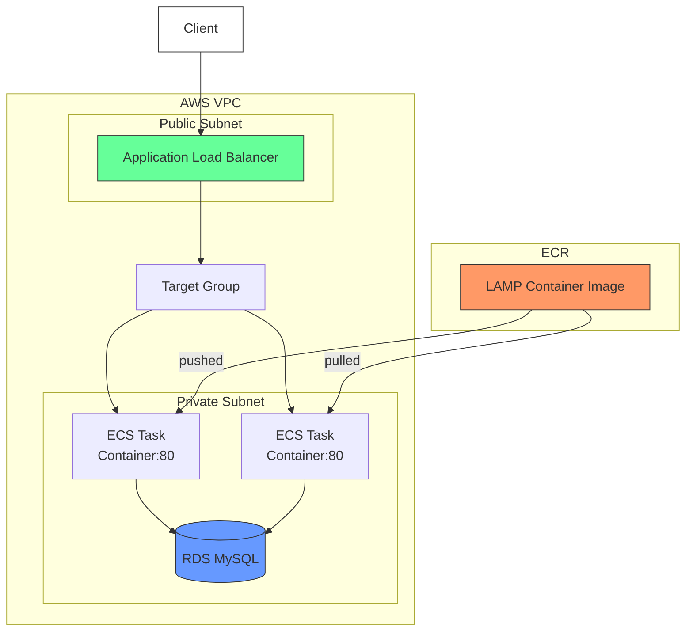

# LAMP Stack Deployment on AWS ECS with ALB - Workflow Documentation

## Overview
This document outlines the workflow for deploying a LAMP (Linux, Apache, MySQL, PHP) stack application to AWS Elastic Container Service (ECS) using an Application Load Balancer (ALB), with the entire process automated through AWS CLI. The deployment uses a private Amazon ECR repository for container images.

## Prerequisites
- AWS account with appropriate permissions
- AWS CLI installed and configured
- Docker installed locally (for building images)
- ECR repository already created
- Basic understanding of ECS, ALB, and LAMP stack

## Workflow Steps

### 1. Application Setup
# for refreence to the application setup and code: [php source code](https://github.com/guderian120/lamp_stack_application)
```
.
├── Dockerfile
├── src/
│   ├── index.php
│   ├── (other PHP files)
├── config/
│   ├── httpd.conf
│   ├── php.ini
└── (other application files)
```

### 2. Build and Push Docker Image to ECR
```bash
# Authenticate Docker with ECR
aws ecr get-login-password --region <region> | docker login --username AWS --password-stdin <account-id>.dkr.ecr.<region>.amazonaws.com

# Build the Docker image
docker build -t <ecr-repo-name>:<tag> .

# Tag the image
docker tag <ecr-repo-name>:<tag> <account-id>.dkr.ecr.<region>.amazonaws.com/<ecr-repo-name>:<tag>

# Push the image to ECR
docker push <account-id>.dkr.ecr.<region>.amazonaws.com/<ecr-repo-name>:<tag>
```

### 3. Infrastructure Deployment via AWS CLI

#### Create ECS Cluster
```bash
aws ecs create-cluster --cluster-name lampstack-cluster
```

#### Create ALB and Target Group
```bash
# Create ALB
aws elbv2 create-load-balancer --name lampstack-alb --subnets <subnet-id-1> <subnet-id-2> --security-groups <security-group-id>

# Create Target Group
aws elbv2 create-target-group --name lampstack-tg --protocol HTTP --port 80 --vpc-id <vpc-id> --target-type ip --health-check-path /health
```

#### Create ECS Task Definition
```bash
aws ecs register-task-definition --family lampstack-task \
  --network-mode awsvpc \
  --execution-role-arn ecsTaskExecutionRole \
  --cpu 1024 \
  --memory 2048 \
  --requires-compatibilities FARGATE \
  --container-definitions '[
    {
      "name": "lampstack-container",
      "image": "<account-id>.dkr.ecr.<region>.amazonaws.com/<ecr-repo-name>:<tag>",
      "essential": true,
      "portMappings": [
        {
          "containerPort": 80,
          "hostPort": 80,
          "protocol": "tcp"
        }
      ],
      "environment": [
        {"name": "DB_HOST", "value": "<rds-endpoint>"},
        {"name": "DB_NAME", "value": "<database-name>"},
        {"name": "DB_USER", "value": "<username>"},
        {"name": "DB_PASSWORD", "value": "<password>"}
      ],
      "logConfiguration": {
        "logDriver": "awslogs",
        "options": {
          "awslogs-group": "/ecs/lampstack",
          "awslogs-region": "<region>",
          "awslogs-stream-prefix": "ecs"
        }
      }
    }
  ]'
```

#### Create ECS Service
```bash
aws ecs create-service --cluster lampstack-cluster \
  --service-name lampstack-service \
  --task-definition lampstack-task:1 \
  --desired-count 2 \
  --launch-type FARGATE \
  --network-configuration "awsvpcConfiguration={subnets=[<subnet-id-1>,<subnet-id-2>],securityGroups=[<security-group-id>],assignPublicIp=ENABLED}" \
  --load-balancers "targetGroupArn=<target-group-arn>,containerName=lampstack-container,containerPort=80"
```

### 4. Verify Deployment
```bash
# Check service status
aws ecs describe-services --cluster lampstack-cluster --services lampstack-service

# Get ALB DNS name
aws elbv2 describe-load-balancers --names lampstack-alb --query 'LoadBalancers[0].DNSName' --output text
```

## Architecture Diagram





## Maintenance and Updates

### Update the Application
1. Build and push new Docker image to ECR
2. Update task definition:
```bash
aws ecs register-task-definition --cli-input-json file://new-task-def.json
```
3. Update service:
```bash
aws ecs update-service --cluster lampstack-cluster --service lampstack-service --task-definition lampstack-task:2
```

### Scale the Service
```bash
aws ecs update-service --cluster lampstack-cluster --service lampstack-service --desired-count 4
```

## Cleanup
```bash
# Delete service
aws ecs delete-service --cluster lampstack-cluster --service lampstack-service --force

# Delete task definition
aws ecs deregister-task-definition --task-definition lampstack-task:1

# Delete ALB and target group
aws elbv2 delete-load-balancer --load-balancer-arn <alb-arn>
aws elbv2 delete-target-group --target-group-arn <target-group-arn>

# Delete cluster
aws ecs delete-cluster --cluster lampstack-cluster

# Delete ECR images (optional)
aws ecr batch-delete-image --repository-name <ecr-repo-name> --image-ids imageTag=<tag>
```

## Troubleshooting
- Check ECS service events: `aws ecs describe-services --cluster lampstack-cluster --services lampstack-service`
- View container logs in CloudWatch
- Check ALB access logs
- Verify security group rules allow traffic on port 80

## Notes
- All sensitive data (passwords, etc.) should be stored in AWS Secrets Manager or SSM Parameter Store
- Consider adding auto-scaling policies for production workloads
- Implement CI/CD pipeline for automated deployments